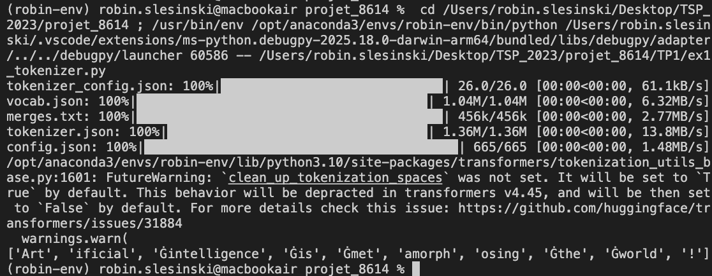
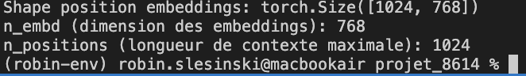
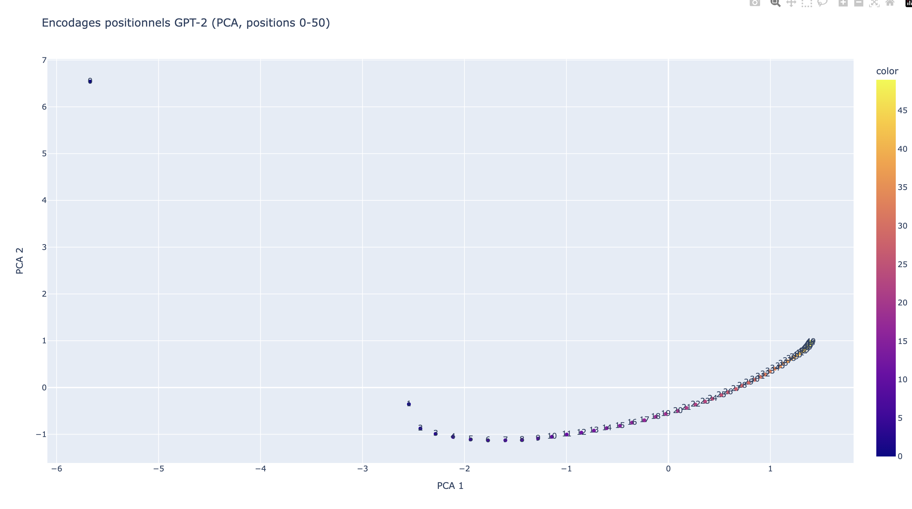
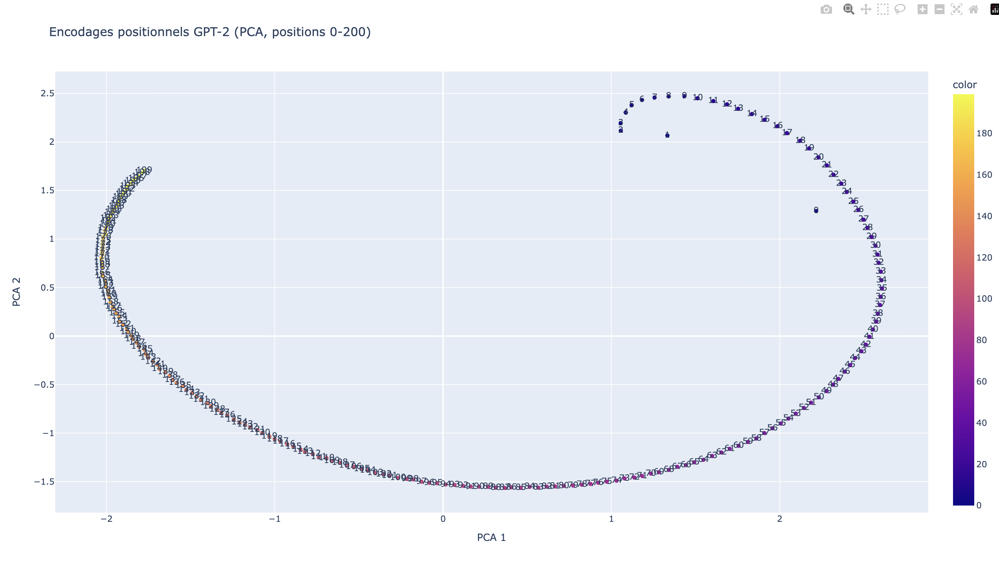
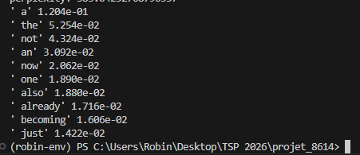
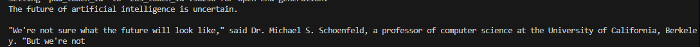
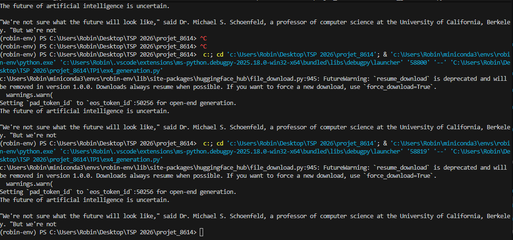
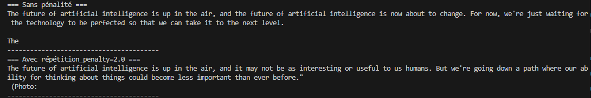

**Nom / Prénom** : Robin Slesinski

**Installation et activation de l’environnement** :
```bash
# Créer l'environnement conda
conda create -n tp1 python=3.10

# Activer l'environnement
conda activate tp1

# Installer les dépendances
pip install -r requirements.txt

```


### Comment vérifier les versions (preuve possible)
```bash
python --version
pip show numpy pandas scikit-learn torch transformers plotly
```

**Exercice 2:Découverte du tokenizer GPT-2**: 

Question 2.a:

['Art', 'ificial', 'Ġintelligence', 'Ġis', 'Ġmet', 'amorph', 'osing', 'Ġthe', 'Ġworld', '!']

Dans le tokenizer GPT-2, le symbole spécial Ġ indique la présence d’un espace avant le token dans le texte original. GPT-2 ne sépare pas explicitement les espaces : ceux-ci sont intégrés directement dans les tokens via ce préfixe. Cela permet au modèle de conserver l’information de positionnement des mots et de distinguer, par exemple, un mot en début de phrase d’un mot précédé d’un espace. Ce choix est lié au fonctionnement du Byte Pair Encoding (BPE) utilisé par GPT-2.



Question 2.b:

Token IDs: [8001, 9542, 4430, 318, 1138, 37670, 2752, 262, 995, 0]

| Décodage        | Token ID | Remarque                          |
|-----------------|----------|-----------------------------------|
| Artificial      | 8001     | Début de phrase                   |
|  intelligence   | 9542     | Espace initial (Ġ implicite)      |
|  is             | 318      | Mot très fréquent                 |
|  meta           | 1138     | Sous-mot (BPE)                    |
| morph           | 37670    | Fragment interne de mot           |
| osing           | 2752     | Fin de mot                        |
|  the            | 262      | Mot fonctionnel fréquent          |
|  world          | 995      | Mot courant                       |
| !               | 0        | Ponctuation                       |

Les tokens sont les unités textuelles (mots ou sous-mots) issues de la tokenisation BPE.
Les token IDs sont les identifiants numériques associés à chaque token dans le vocabulaire GPT-2.
Le modèle ne traite que des IDs : le texte est converti en IDs avant l’inférence, puis décodé après. Cette représentation permet une manipulation efficace et cohérente du langage par le modèle.

Question 2.c:

GPT-2 encode les mots fréquents (“is”, “the”) en un seul token, tandis que les mots longs ou rares (“metamorphosing”) sont découpés en sous-mots (meta, morph, osing). La ponctuation est représentée par des tokens distincts, et les espaces sont intégrés directement au début de certains tokens. Ce comportement reflète le principe du BPE, qui réutilise des fragments fréquents pour représenter efficacement le texte.

Question 2.d:

Token IDs: [8001, 9542, 4430, 318, 1138, 37670, 2752, 262, 995, 0]
['G', 'PT', 'Ġmodels', 'Ġuse', 'ĠB', 'PE', 'Ġtoken', 'ization', 'Ġto', 'Ġprocess', 'Ġunusual', 'Ġwords', 'Ġlike', 'Ġant', 'idis', 'establishment', 'arian', 'ism', '.']
Sous-tokens du mot long : ['Ġant', 'idis', 'establishment', 'arian', 'ism']
Nombre de sous-tokens : 5

Le mot rare et très long antidisestablishmentarianism est découpé en 5 sous-tokens. GPT-2 utilise ainsi le Byte Pair Encoding pour réutiliser des fragments fréquents (ant, idis, establishment, etc.) au lieu de créer un token unique pour le mot entier. Les sous-tokens conservent l’espace initial lorsqu’il est présent (Ġant), illustrant comment le tokenizer encode simultanément la structure des mots et la segmentation en sous-unités.

# Exercice 3 : Analyse des encodages positionnels dans GPT-2

Question 3.a :



La matrice des embeddings positionnels a pour shape (1024, 768) :

- 1024 correspond au nombre maximum de positions (tokens) que le modèle peut encoder, c’est-à-dire la longueur maximale du contexte.

- 768 correspond à la dimension de chaque vecteur d’embedding positionnel.

n_positions définit la taille de la fenêtre de contexte pour le modèle causal GPT-2 : 

le modèle ne peut pas représenter explicitement plus de 1024 tokens simultanément. Ces embeddings positionnels permettent au Transformer de prendre en compte l’ordre des tokens malgré l’attention non séquentielle.

Question 3.b :


Le graphique révèle une structure en courbe continue très régulière. On remarque que la position 0 est isolée, tandis que les positions suivantes (1 à 50) s'enchaînent selon une trajectoire fluide et ordonnée. Il n'y a pas de clusters aléatoires : la proximité géométrique des points sur le plan correspond directement à leur proximité dans la séquence. Cela montre que GPT-2 a appris une représentation logique et topologique de l'ordre des mots.

La PCA est indispensable ici car les embeddings originaux possèdent 768 dimensions, ce qui est impossible à visualiser. En réduisant ces données à 2 dimensions tout en conservant le maximum de variance, la PCA permet de "voir" la structure mathématique apprise par le modèle. Elle prouve que l'information de position n'est pas stockée de façon chaotique, mais suit une organisation géométrique cohérente que l'on peut enfin interpréter à l'œil nu.

Question 3.c :



**Comparaison : Échelle 0–50 vs 0–200**
Changement d'échelle : En passant à 200 positions, la structure devient beaucoup plus complexe. Alors que le graphique 0–50 ne montrait qu'un arc de cercle simple, celui-ci révèle une forme en spirale ou en "fer à cheval" beaucoup plus prononcée.

Lisibilité : La structure globale reste très lisible et ordonnée, mais on remarque que les points se densifient à mesure que la position augmente (en haut à gauche du "fer à cheval"). Les premières positions (0 à 10) sont plus étalées et distinctes, alors que les positions lointaines semblent se rapprocher dans l'espace latent.

**Hypothèse sur la représentation**
La forme en spirale suggère que GPT-2 utilise une logique de périodicité pour encoder l'ordre des mots, similaire à des fonctions sinus/cosinus. Cette géométrie implique que le modèle privilégie la continuité locale : il distingue très précisément les premières positions (plus espacées sur la courbe), mais semble "compresser" les positions lointaines où la courbe se resserre. Pour le modèle, la différence entre la position 1 et 2 est donc plus marquée et plus cruciale qu'entre la position 190 et 191.

# Exercice 4 : Probabilités et génération de texte avec GPT-2

Question 4.a : 

Token 1: 'ificial' -> prob=1.920e-05
Token 2: ' intelligence' -> prob=1.505e-01
Token 3: ' is' -> prob=1.955e-01
Token 4: ' fascinating' -> prob=6.504e-04
Token 5: '.' -> prob=1.773e-01

Dans GPT-2, le modèle est causal, c’est-à-dire qu’il prédit chaque token en se basant uniquement sur les tokens précédents. Les logits produits à la position t-1 représentent donc la distribution de probabilité pour le token suivant, t, en conditionnant sur tous les tokens de 0 à t-1. C’est pour cette raison que, pour obtenir la probabilité d’un token observé à la position t, on lit probs[0, t-1, token_id]. Cette organisation reflète exactement la factorisation causale des modèles de langage : chaque token est prédit uniquement à partir du contexte précédent, ce qui permet au modèle de générer du texte de manière séquentielle tout en conservant l’information contextuelle.

Question 4.b : 

total_logp: -23.45488703250885 
avg_neg_logp: 4.69097740650177 
perplexity: 108.95962562504104

La perplexité mesure à quel point le modèle GPT-2 “est surpris” par la phrase. Une perplexité de ~109 signifie que, en moyenne, le modèle considère que chaque token a environ 1 chance sur 109 d’être prédit correctement dans ce contexte. Plus la perplexité est faible, plus le modèle trouve la séquence probable. Calculer la perplexité via la log-probabilité moyenne permet d’éviter les problèmes numériques liés au produit direct de petites probabilités. Elle sert d’indicateur standard pour comparer la qualité prédictive des modèles de langage : un modèle meilleur donnera systématiquement une perplexité plus faible sur des phrases similaires.


Question 4.c:

Pour la nouvelle phrase: *Artificial fascinating intelligence is.*

Token 1: 'ificial' -> prob=1.920e-05
Token 2: ' fascinating' -> prob=1.811e-06
Token 3: ' intelligence' -> prob=2.291e-04
Token 4: ' is' -> prob=1.236e-01
Token 5: '.' -> prob=4.955e-04
total_logp: -42.164626359939575
avg_neg_logp: 8.432925271987916
perplexity: 4595.924777972143

Phrase	                                    total_logp	avg_neg_logp	perplexité
"Artificial intelligence is fascinating."	-23.45	    4.69	        108.96
"Artificial fascinating intelligence is."	-42.16	    8.43	        4595.92

On constate que la deuxième phrase, dont l’ordre des mots est incorrect, a une log-probabilité totale beaucoup plus faible et une perplexité très élevée (~4596 contre ~109 pour la phrase correcte). Cela reflète que GPT-2 considère cette séquence comme très improbable par rapport aux données sur lesquelles il a été entraîné. La distribution d’entraînement contient majoritairement des phrases grammaticalement correctes avec un ordre naturel des mots, et le modèle apprend ces régularités. Ainsi, une phrase mal structurée ou inversée viole ces patterns appris, ce qui se traduit par des probabilités conditionnelles très faibles pour plusieurs tokens, augmentant fortement la perplexité. La perplexité permet donc d’évaluer la grammaticalité et la plausibilité d’une phrase selon le modèle.

Question 4.d:

Pour la nouvelle phrase: *L'intelligence artificielle est fascinante.*

Token 1: "'" -> prob=3.138e-03
Token 2: 'intelligence' -> prob=2.804e-05
Token 3: ' artific' -> prob=7.070e-06
Token 4: 'iel' -> prob=1.810e-02
Token 5: 'le' -> prob=1.711e-01
Token 6: ' est' -> prob=1.325e-02
Token 7: ' fasc' -> prob=3.444e-05
Token 8: 'in' -> prob=6.783e-02
Token 9: 'ante' -> prob=4.595e-03
Token 10: '.' -> prob=5.368e-02
total_logp: -59.481460213661194
avg_neg_logp: 5.948146021366119
perplexity: 383.04252768796357

Phrase	                                    total_logp	avg_neg_logp	perplexité
"Artificial intelligence is fascinating."	-23.45	    4.69	        108.96
"Artificial fascinating intelligence is."	-42.16	    8.43	        4595.92
"L'intelligence artificielle est fascinante."-59.48     5.95            383.04

La phrase en français a une perplexité beaucoup plus élevée que la phrase anglaise correcte (~383 contre ~109), mais reste bien inférieure à la phrase anglaise avec un ordre incorrect (~4596). Cela montre que GPT-2, entraîné majoritairement sur de l’anglais, trouve les tokens français peu probables individuellement, ce qui augmente la perplexité, mais la structure syntaxique reste cohérente avec des patterns appris (tokens fréquents ou séquences simples), donc la perplexité n’explose pas comme pour l’anglais mal ordonné. En pratique, cela reflète la distribution d’entraînement : le modèle connaît peu le français, chaque token français est rare, et le mélange de langues entraîne des probabilités plus faibles par token, ce qui se traduit par une perplexité intermédiaire.

Question 4.e :



Le modèle prédit comme le plus probable le token ' a', ce qui correspond à un article indéfini souvent utilisé après "is". On remarque que les tokens les plus probables sont des mots fréquents en anglais qui peuvent continuer la phrase de façon naturelle (articles, adverbes, verbes, mots de liaison). Cette distribution reflète la probabilité conditionnelle apprise par GPT-2, basée sur le contexte "Artificial intelligence is". Les probabilités décroissent rapidement, indiquant que le modèle a identifié quelques continuations plausibles tandis que les autres tokens sont beaucoup moins probables. Cela illustre comment GPT-2 capture les régularités du langage et l’ordre syntaxique appris depuis son corpus d’entraînement.

# Exercice 5 : Exploration des méthodes de génération avec GPT-2

Question 5.a : 

Le seed est fixé (SEED = 42) pour rendre la génération reproductible. Sans seed, chaque exécution pourrait produire un texte différent, même avec les mêmes paramètres, car certaines méthodes de génération (comme l’échantillonnage) utilisent des tirages aléatoires. Fixer le seed permet de répéter exactement les mêmes résultats pour analyser et comparer les effets des différentes techniques de génération.

Question 5.b :



The future of artificial intelligence is uncertain.

"We're not sure what the future will look like," said Dr. Michael S. Schoenfeld, a professor of computer science at the University of California, Berkeley. "But we're not

Après avoir lancé trois fois le script : 



le décodage glouton choisit toujours le token le plus probable à chaque étape. Il est déterministe, donc reproductible, mais peut donner des phrases moins variées et parfois tronquées ou répétitives.

Question 5.c : 

**Rôle des paramètres :**

    - temperature (ici 0.7) adoucie la distribution : plus faible = choix plus concentré sur les tokens probables, plus élevée = plus de diversité.

    - top_k limite le choix aux k tokens les plus probables, empêchant le modèle de tirer des tokens très improbables.

    - top_p (nucleus sampling) choisit dynamiquement le plus petit ensemble de tokens dont la somme des probabilités atteint p (0.95 ici), garantissant que seuls les tokens plausibles sont échantillonnés.


Avec le sampling, chaque génération produit des phrases différentes même en partant du même préfixe, ce qui augmente la diversité du texte. Malgré cette variabilité, les phrases restent globalement cohérentes, grammaticales et pertinentes par rapport au contexte du prompt. De plus, les répétitions sont beaucoup moins fréquentes que lors d’un décodage glouton sur de longues séquences, en grande partie grâce aux contraintes top-k et top-p qui limitent le choix aux tokens les plus plausibles à chaque étape.

Question 5.d :



Avec repetition_penalty=2.0, les répétitions sont nettement réduites : la phrase “the future of artificial intelligence is” n’est plus répétée. Le texte devient plus varié et fluide, mais certaines formulations peuvent paraître un peu moins naturelles ou plus générales, illustrant le compromis entre diversité et cohérence.

Question 5.e : 


Avec une température basse, le texte est très cohérent mais peu diversifié et parfois répétitif. Une température élevée augmente la diversité et la créativité, mais peut produire des phrases moins précises ou légèrement moins naturelles. Le compromis consiste donc à équilibrer stabilité/cohérence et variété/innovation dans la génération.

Question 5.f : 


Le beam search produit un texte plus probable globalement que le greedy ou le sampling, car il évalue plusieurs séquences candidates avant de choisir la meilleure. En conséquence, les phrases sont souvent plus génériques et moins créatives, reflétant des continuations courantes et sûres. Comparé au sampling, le texte est moins divers et moins surprenant, tandis que comparé au greedy, il reste cohérent tout en réduisant légèrement les répétitions.

Question 5.g : 


Avec l’augmentation du nombre de beams de 5 à 20, le temps de génération augmente (2,34 s → 4,40 s) car le modèle doit maintenir et évaluer plus de séquences candidates à chaque étape. Les phrases générées restent très cohérentes et grammaticales, mais peu variées et relativement génériques, même avec plus de beams. Cela montre que beam search maximise la probabilité globale tout en sacrifiant la diversité, et que l’exploration de plusieurs chemins augmente le coût computationnel.

