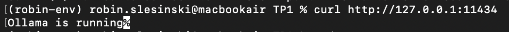
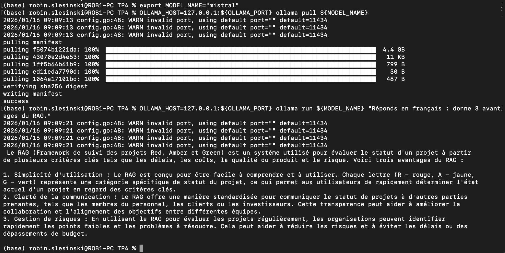
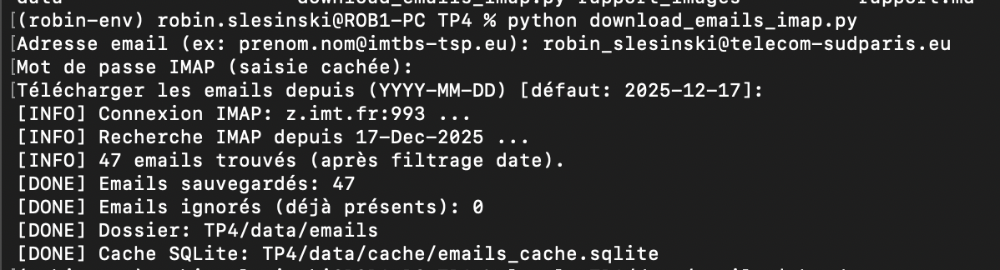
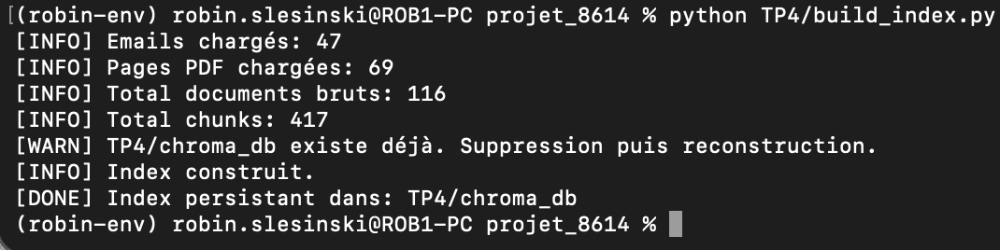
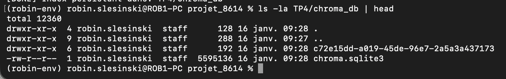
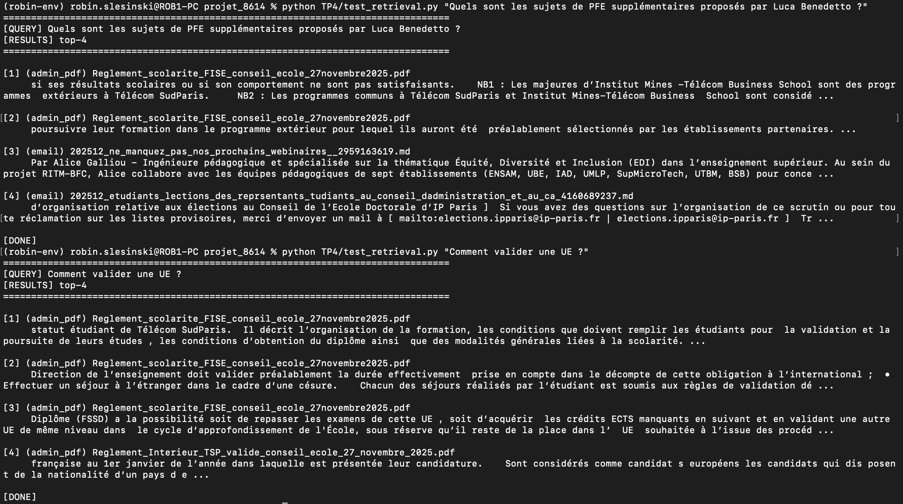
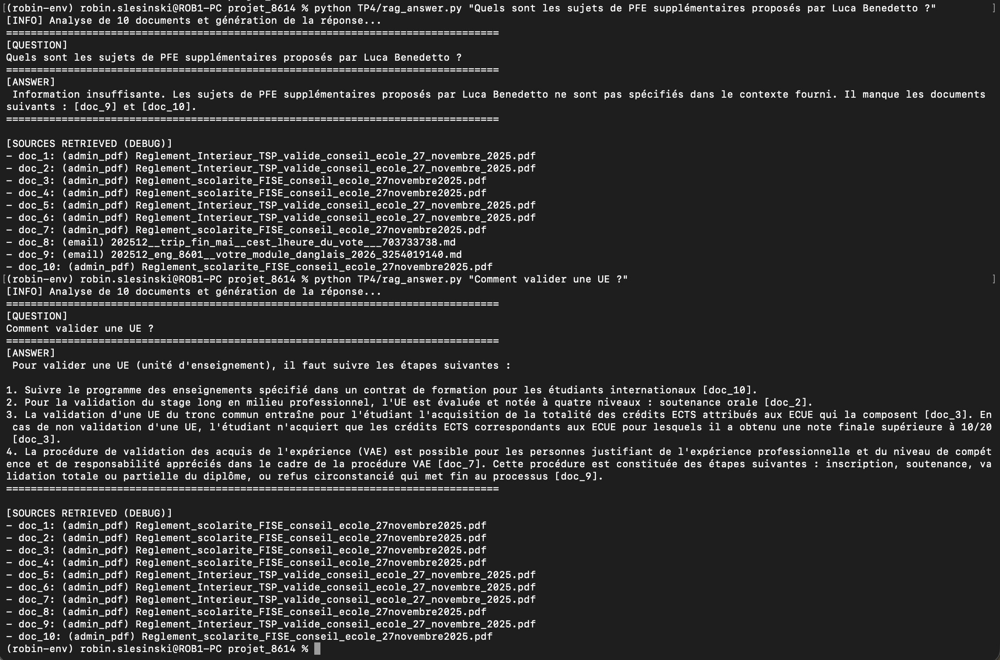
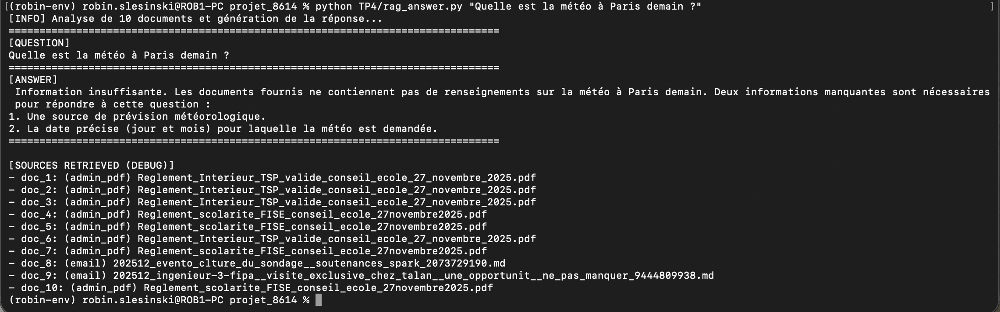
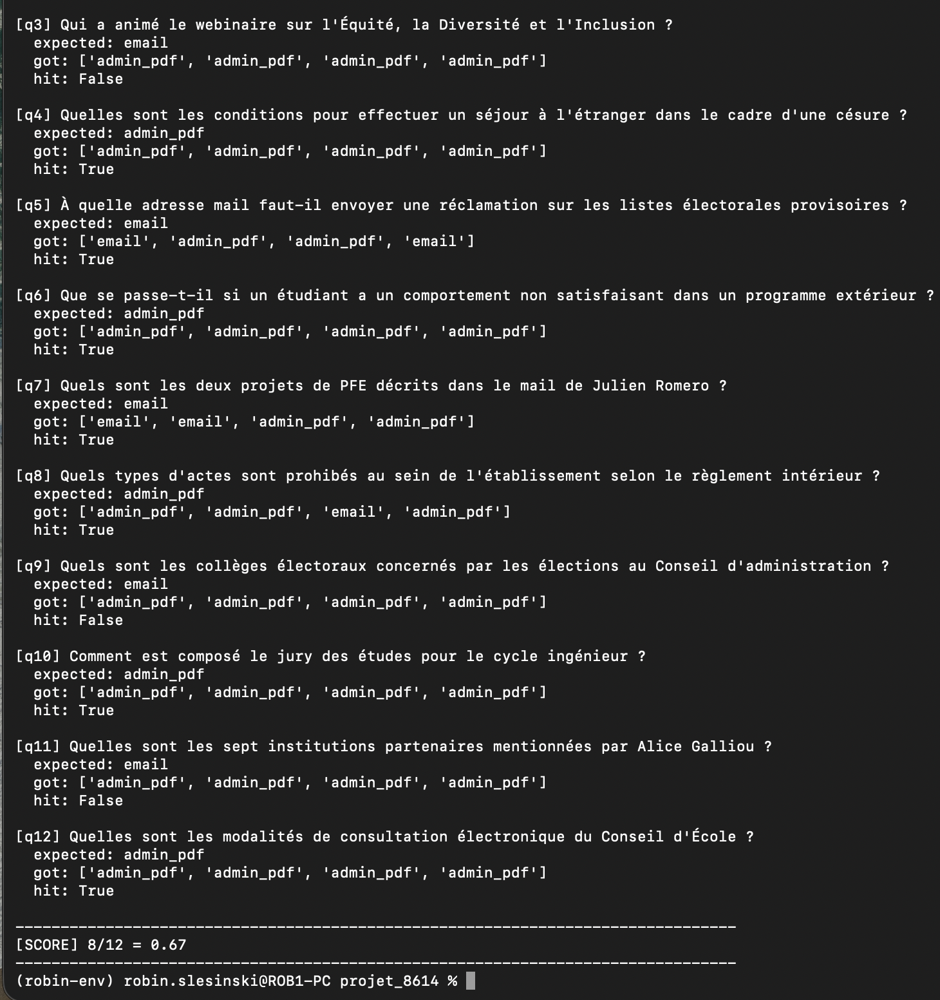
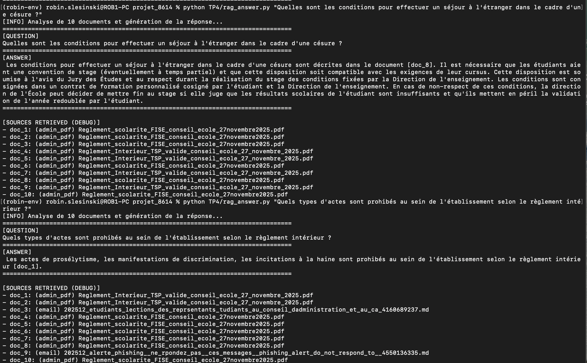

# Exercice 1 

Question 1. :

port par défaut : 11434

# Exercice 2

nombre de fichiers créés : 47

# Exercice 3 

# Exercice 4

Avec TOP_K = 4 :

"Comment valider une UE ?" Le système fonctionne très bien ici.

 Le chunk [3] est une "pépite". Il mentionne explicitement le rattrapage d'examens d'une UE ou l'acquisition de crédits ECTS. Le document Reglement_scolarite_FISE est la source logique pour cette question. Le système de recherche sémantique a bien fait le lien entre "valider" et le texte du règlement.

 Par contre, "Luca Benedetto" 

Ici, le système remonte des documents sur le règlement de scolarité et les élections, ce qui est totalement hors-sujet. Il est très probable que le nom "Luca Benedetto" soit noyé dans un chunk trop grand. Les résultats [1] et [2] sortent car le modèle d'embedding essaie désespérément de trouver "quelque chose" qui ressemble vaguement à une proposition ou un programme, mais il échoue.

On va modifier les paramètres suivants: 

CHUNK_SIZE = 500 et CHUNK_OVERLAP = 50, puis TOP_K = 6

Malheureusement, pour la deuxième, on ne trouve toujorus pas le mail, même avec top_k = 10...

# Exercice 5 

Question 5.e:

# Exercice 6 

Analyse des Échecs (2 Cas Concrets)
Cas 1 : La question "Luca Benedetto" (q1)
Observation : expected: email / got: ['admin_pdf', ...] -> FAIL.

Cause probable : Le Bruit Sémantique. Les mots "sujets", "PFE" et "proposés" sont extrêmement fréquents dans les règlements de scolarité. Pour l'algorithme de similarité, les pages officielles du règlement ont une "densité" de mots-clés académiques plus forte que le petit email informel de Julien Romero. Le nom propre "Luca Benedetto" n'a pas suffi à compenser le poids des termes administratifs environnants.

Impact : Le LLM ne pourra jamais répondre car il ne recevra que du texte sur les jurys ou les examens.

Analyse d'échec : Le cas "Collèges électoraux" (q9)
La Question : "Quels sont les collèges électoraux concernés par les élections au Conseil d'administration ?"

Résultat Retrieval : got: ['admin_pdf', 'admin_pdf', 'admin_pdf', 'admin_pdf'] -> FAIL.

Le contenu attendu (Email) : L'email 202512_etudiants_lections... contient la liste précise des collèges (Collège A, B, Étudiants, etc.) pour le scrutin actuel.

Le contenu obtenu (PDF) : Le moteur remonte le Règlement Intérieur qui explique la théorie du fonctionnement du Conseil d'École et des commissions.

J'ai choisi les questions 4, 8 et 10 :

Question,Résultat obtenu,Score,Justification
Q4 : Séjour étranger / Césure,Réponse détaillée citant le Jury des Études et le contrat de formation.,
2
Excellent : La réponse est très complète, cite la source correcte [doc_8] et donne la procédure exacte (contrat cosigné).

Q8 : Actes prohibés,"Liste le prosélytisme, la discrimination et la haine."
2
Correct + Sourcé : Réponse concise et conforme au Règlement Intérieur cité en [doc_1]. Très efficace.

Q12 : Consultation électronique,Définit l'accès technique nécessaire pour la participation effective.
2
Correct + Actionnable : L'information est bien extraite du document [doc_4] et répond précisément à la modalité technique.

Le système RAG est très performant pour extraire des règles précises dans les documents administratifs denses, grâce à une excellente indexation des fichiers PDF. Les réponses générées sont fidèles, bien sourcées et évitent les hallucinations.

Cependant, la principale limite réside dans la "domination" des règlements sur les emails, ces derniers étant souvent noyés lors de la recherche sémantique. Pour un déploiement réel, l'amélioration prioritaire serait l'ajout d'un système de reranking ou d'un filtrage par métadonnées pour garantir que les informations ponctuelles des emails soient mieux valorisées face au bruit des documents officiels.